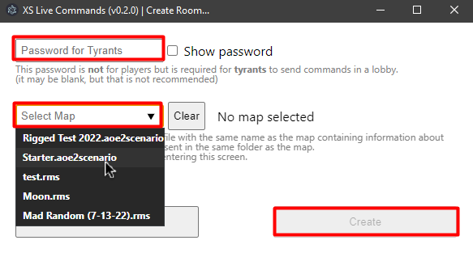
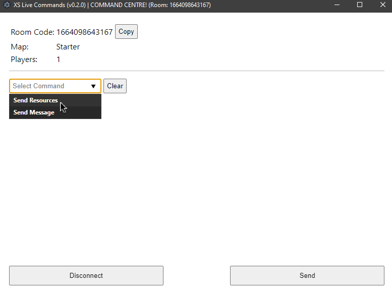
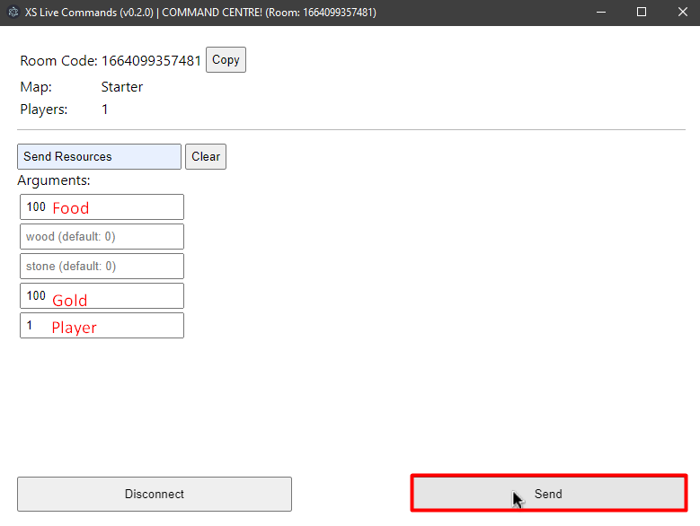
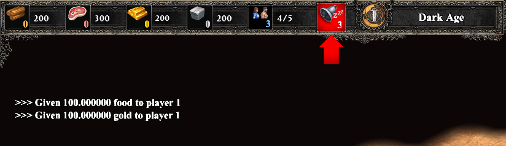
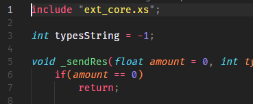
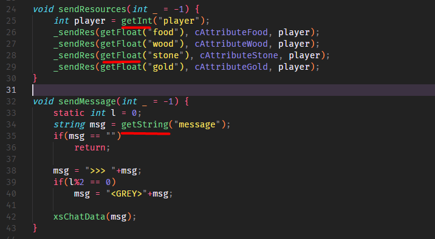
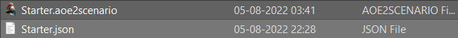
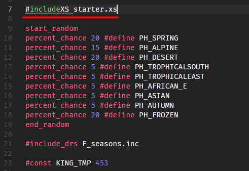

# XS Live Commands

This application allows running triggers/XS functions in live AoE2:DE custom map (RMS/CS) games, on request, externally. Think of it something like [Choice Chamber](https://store.steampowered.com/app/359960/Choice_Chamber/) or T90's overlords, but without the overlord needing to be in the game itself!

> Note: This application is not a hack, a special map (Custom Scenario or RMS) needs to be made in order to use this application

You can head over to INSERT MKDOCS LINK to find out more about the application and how to use it!

## Installation

Head over to the [releases](https://github.com/prelusion/XSLiveCommands/releases) page and download the `exe` with the following name:

> XS.Live.Commands_0.2.0.exe

Follow the instructions in the installation wizard to complete installation

## Usage

The usage is split into two parts:

1. for **end users** wanting to play on a map that is made for this application
2. for **Map Makers** wanting to make a map that supports this application

### End Users

1. After installation, click "Create a RoomOld".
2. On this screen, enter a room password and select a map. All maps that support usage for this application will be automatically detected and displayed. Now click "Create".
   
3. When on the lobby screen, you can copy the lobby code and send it to other players who can then join the room as a player/spectator or as a tyrant. A tyrant is the person who can choose to run effects and commands on players while a game is being played.
4. If a person joins as a tyrant, they are required to input the password created by the host initially. Then they are shown the following screen:
   
5. On this screen, they can pick any command that the map supports, and enter some values related to the command. For example, here the tyrant can send resources to a particular player in the game:
   
   Ingame:
   
6. While players can join/leave a lobby at any time they want, all players playing the game MUST be connected to the lobby when a tyrant issues a command, otherwise the game will go out of sync.

### Map Makers

Note: In the steps below, it is assumed that you are familiar with:
1. XS Scripting. See [this page](https://ugc.aoe2.rocks/general/xs/) if you are unfamiliar with XS
2. JSON files. See [this page](https://www.w3schools.com/js/js_json_intro.asp) if you're unfamiliar with JSON.

To make a map that supports usage of this application, the following is required:
1. An XS script containing the code for effects. A [starter.xs](./XS/starter.xs) file is provided to help you get started!
2. A JSON file describing the above effects (see details below). A [starter.json](./XS/starter.json) is provided to help you get started!
3. A Custom Scenario/RMS Map.

#### XS

To create an XS script that can integrate with this application, you must:

1. Include the [`ext_core.xs`](./XS/ext_core.xs) script that is provided in the `XS` folder of this repository.
   
2. Create a function in your XS script that contains the code for your intended effect. This function must accept exactly one integer argument. This is not actually used, but is just required to make the code work.
3. Inside your function, you can use the following functions:
    1. `getInt("argName")`
    2. `getFloat("argName")`
    3. `getString("argName")`
    4. `getBool("argName")`
       
4. The `argName` can be anything you like, but they must be described in the JSON file (see below) for the application to know how to insert them when your effect function is run.

#### JSON

A JSON file is used to tell the application which functions to run in your XS code for which command and how to properly insert your desired values/arguments for the `getXX("argName")` functions to use.

1. Create a JSON file with the same name as the Custom Scenario or RMS in the same folder as the former for the application to detect your map.
   
2. The JSON file must contain one array with objects that can have the following format:

```json
[ // one array in the entire json file
    {
        "name": "Send Message", // This name is what is displayed in the app when browsing through the select command menu
        "funcName": "sendMessage", // the name of the function to run for this command
        "params": [ // this is an array of parameters
            {
                "name": "message", // This is what is used in the getXX(argName) function, also what is shown in the app itself
                "type": "string", // can be one of 1. int 2. float 3. bool 4. string. This is what determines which getXX(argName) function to use in your function code
                "default": "Hello" // This value is used if the tyrant does not specify a value for this parameter themselves.
            }
        ]
    }
]
```

Note: you are not allowed to put comments in an actual JSON file, but I have used them here to highlight what each component of the JSON does.

#### A custom map

Finally, include your XS script in:

1. A custom scenario like so:

Note: You do not need to write the extension for the file in this field.
2. An RMS file like so:

Note: This include should be at the top of your file. The file extension must be specified here. (thxDE for consistency)

You are now ready to publish your mod and play your map with the application! (Note: creating a mod is not required, but highly recommended)