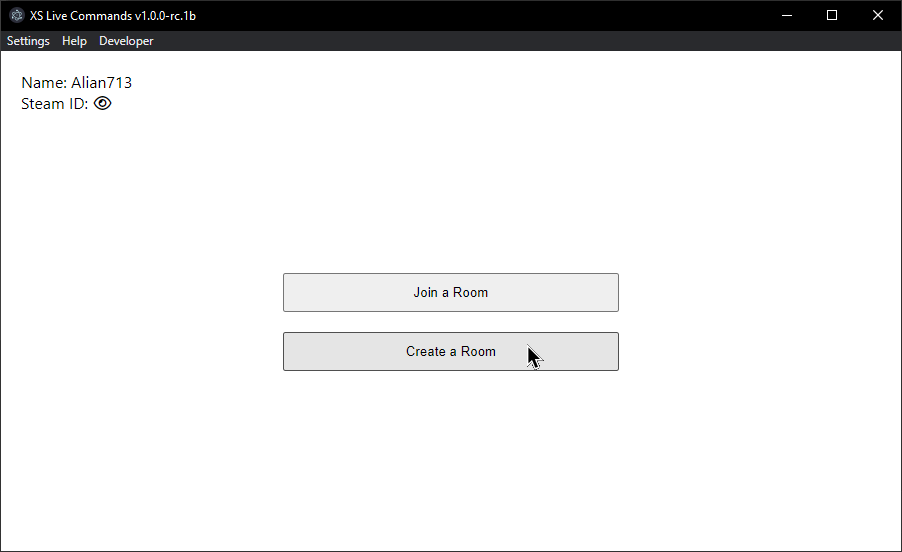
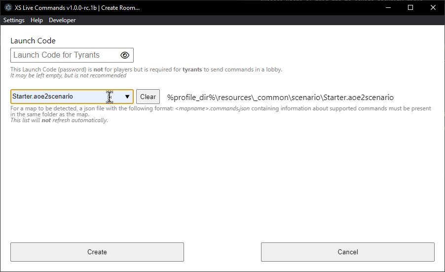
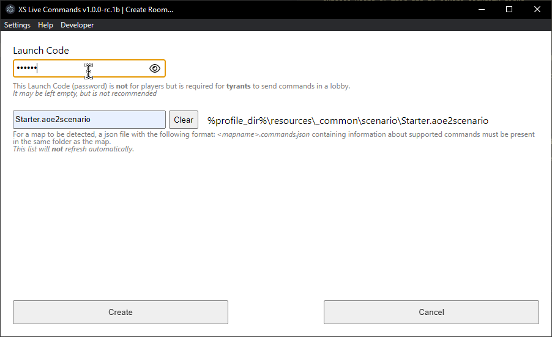
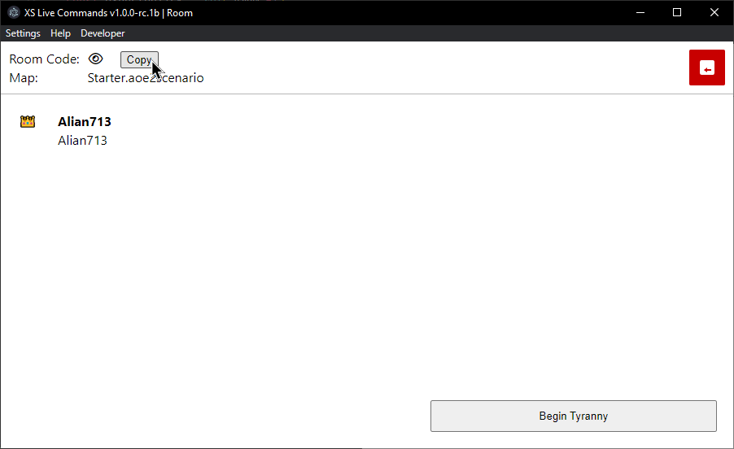
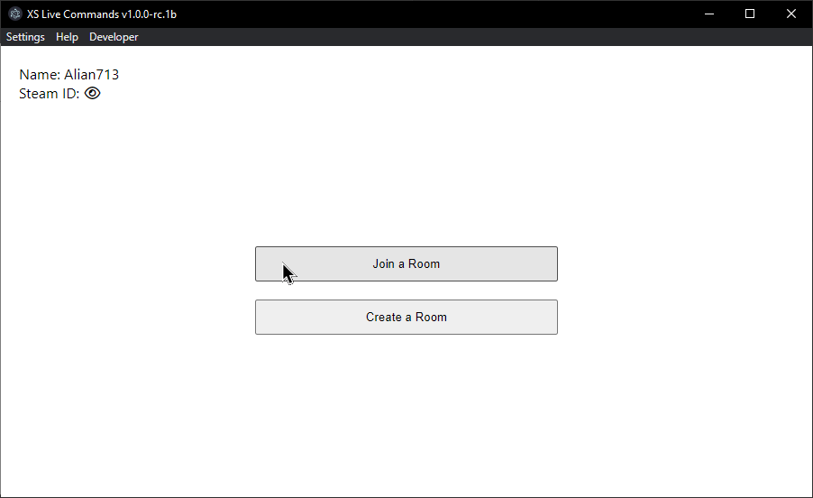
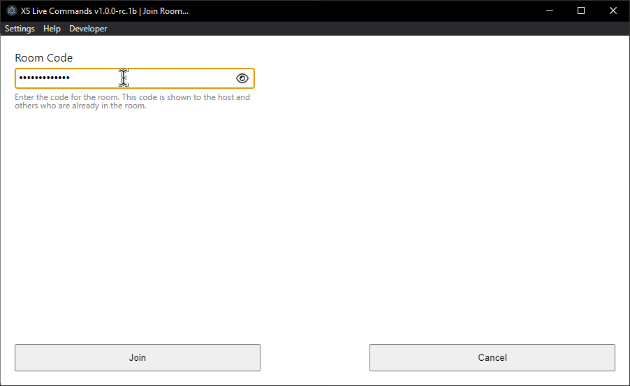
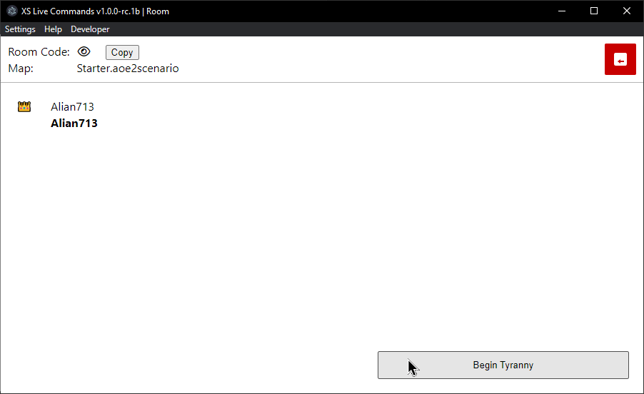
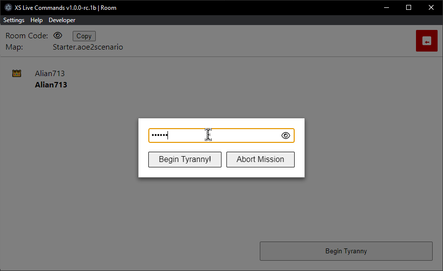
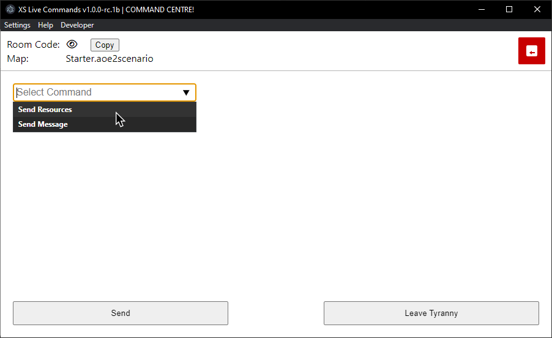

## Rooms

XSLC rooms work exactly like DE's lobbies. XSLC will run triggers/XS functions live, on demand, from the custom map being played for all players/spectators in this room. Make sure all your players/spectators are in this room before starting the game!

### Create a Room

1. Click "Create a Room" to go to the "Create Room..." menu

    <figure markdown="1">
          {: style="height:300px;"}
    </figure>
   
2. Select a map from the map dropdown. Any enabled mods that contain maps that support XSLC will show up here automatically:

    <figure markdown="1">
        {: style="height:300px;"}
    </figure>

    !!! tip "Tip"
        XSLC remembers the map that you last selected and played! Just "Click" create if you wish to replay it.

3. Optionally (recommended) enter a launch code (password) to prevent any player in the room from becoming a Tyrant.

    <figure markdown="1">
        {: style="height:300px;"}
    </figure>

    !!! question "Who is a Tyrant?"
        Simply put, they are the GMs (overlords) of the game and are allowed to issue commands offered by the map to the live game. See [Tyranny](./#tyranny) for more info

4. When you're done, click "Create"! Now click "Copy" and share the room code with everyone whom you want to be able to play/spectate the game! Share the launch code with the people whom you want to be Tyrants

    <figure markdown="1">
        {: style="height:300px;"}
    </figure>

    !!! bug "Replays"
         Replays for games played with XSLC will not work. Live spectating works, but requires the spectator to have the app running and be in the same room as all the players.

### Join an Existing Room

1. Click "Join a Room" to go to the "Join Room..." menu

    <figure markdown="1">
        {: style="height:300px;"}
    </figure>
   
2. Enter the room code in the box and click "Join"!

    <figure markdown="1">
        {: style="height:300px;"}
    </figure>

## Tyranny

Tyrants in an XSLC room are the GMs who can control when triggers/XS functions run in a live game.

### Becoming a Tyrant

Once in a room, to become a Tyrant:

1. Click the "Begin Tyranny" button

    <figure markdown="1">
        {: style="height:300px;"}
    </figure>

2. Enter the launch code when prompted, and click "Being Tyranny!"

    <figure markdown="1">
        {: style="height:300px;"}
    </figure>

    !!! tip "Tip"
        XSLC will remember the launch code for a specific room when you enter it once.

### Issuing Commands

Issuing commands is the way that a Tyrant can tell the app which triggers/XS functions to run. To issue a command:

1. Select a command from the command dropdown

    <figure markdown="1">
        {: style="height:300px;"}
    </figure>

2. Enter the required parameters for the command and click "Send"!

    <figure markdown="1">
        {: style="height:300px;"}
    </figure>
